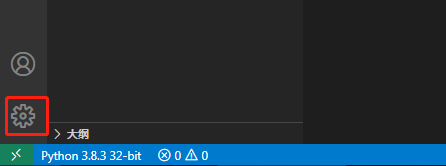
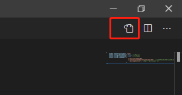
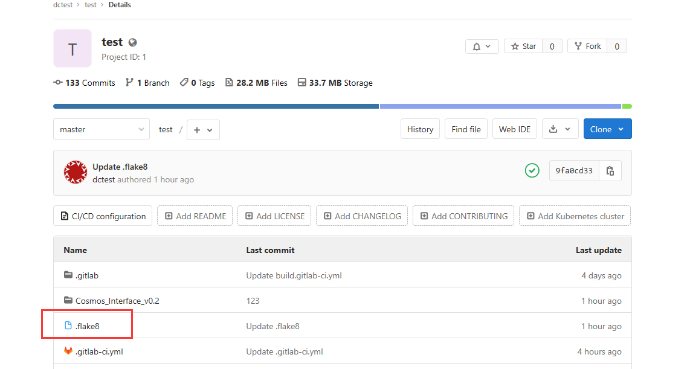
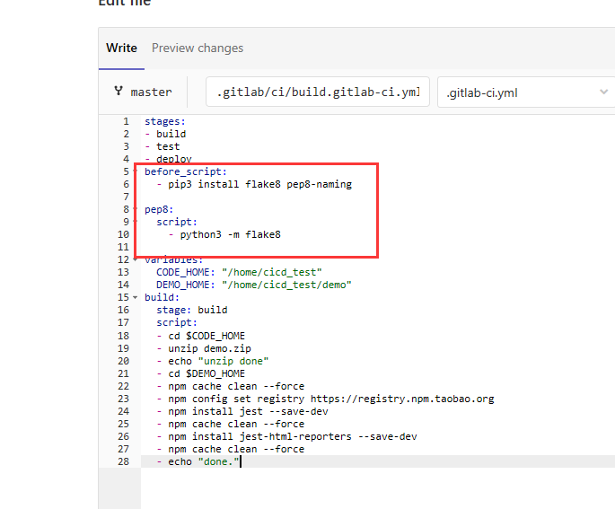

# Python代码检查设置

目录

- [Python代码检查设置](#python代码检查设置)
  - [安装flake8和yapf](#安装flake8和yapf)
  - [设置并启用flake8和yapf](#设置并启用flake8和yapf)
  - [在Gitlab中配置python代码风格检查](#在gitlab中配置python代码风格检查)
  
&nbsp; 
## 安装flake8和yapf

&nbsp; 
- > 其中Flake8是对下面三个工具的封装：
    - PyFlakes：静态检查Python代码逻辑错误的工具。
    - Pep8： 静态检查PEP8编码风格的工具。
    - NedBatchelder’s McCabe script：静态分析Python代码复杂度的工具。

&nbsp; 
- > 打开cmd输入以下命令（Windows默认已安装Python）
    - Flake8安装命令：python -m pip install flake8
    - yapf安装命令：python -m pip install yapf
  
&nbsp; 
## 设置并启用flake8和yapf

&nbsp; 
- > 步骤1：点击VScode左下角设置按钮

    

&nbsp; 
- > 步骤2：点击右上角打开设置文档

    

- > 步骤3：编辑settings.json，输入以下内容

    ``` json
    {
    "python.formatting.provider": "yapf",
    "python.linting.pylintEnabled": false, //关闭pylint
    "python.linting.flake8Enabled": true,  //启用flake8
    "python.linting.flake8Args": [
                                    //单行最长字符数
                                    "--max-line-length=200", 

                                    //忽略的错误ID：E402-模块级导入不在文件顶部；W291-尾随空白,W292-文件末尾没有换行符,W391-文件末尾有空行；N803-函数参数大小写（该提示无法在文件中标识）
                                    "--extend-ignore=E402,W291,W292,W391,N803",    

                                    //代码复杂度，设定不超过10
                                    "--max-complexity=10",  
                                ],
    }
    ```

- > 注意事项：
    - 需要关闭pylint插件，启用flake8进行代码风格检查
    - python.linting.flake8Args中的设置和gitlab中Runner的Python代码风格检查保持一致
    - --extend-ignore表示不提示的错误或警告等信息，根据项目需求如果哪些消息不需要检查则在此添加Code码（错误码可在VSCode编译代码后的消息窗口中查找）也可查询文档 【PEP8_ErrorCodes对照表.md】

&nbsp; 
## 在Gitlab中配置python代码风格检查

&nbsp; 
- > 项目根目录下新建.flake8和.gitlab-ci.yml两个文件

    

&nbsp; 
- > .flake8文件内容如下：

   ``` xml

    [flake8]
    ignore = E402,W291,W292,W391,N803
    exclude =
        *migrations*,
        # python related
        *.pyc,
        .git,
        __pycache__,
        *.log,
        *.html,

    max-line-length=200
    max-complexity=10
    format=pylint
    show_source = True
    statistics = True
    count = True
    --diff=True

    flake8 `git diff --cached --name-only`

   ```

&nbsp; 
- > .gitlab-ci.yml文件内容如下：

   ``` xml

    before_script:
        - pip3 install flake8 pep8-naming

    pep8:
        script:
        - python3 -m flake8

   ```

- > 注意事项：
    - 以上内容须置于脚本最前面，必须在构建之间执行代码检查。如下图所示：
       