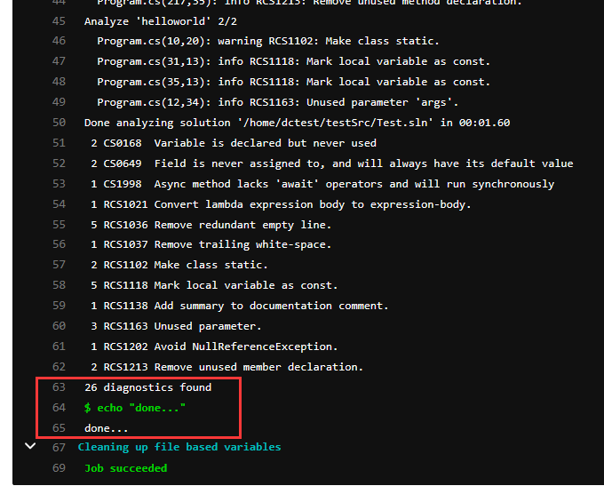

# 代码规范检查

目录

- [代码规范检查](#代码规范检查)    
  - [1. 如何在提交前检查python](#1-如何在提交前检查python)
  - [2. 如何在gitlab中检查python](#2-如何在gitlab中检查python)   
  - [3. 如何在提交前检查js](#3-如何在提交前检查js)  
  - [4. 如何在gitlab中检查js](#4-如何在gitlab中检查js)
  - [5. 如何在提交前检查c++](#5-如何在提交前检查c++)
  - [6. 如何在gitlab中检查c++](#6-如何在gitlab中检查c++)
  - [7. 如何在提交前检查c#](#7-如何在提交前检查c)
  - [8. 如何在gitlab中检查c#](#8-如何在gitlab中检查c)

## 1. 如何在提交前检查python
> 1).项目根目录下安装pre-commit

> npm install pre-commit --save-dev

> 2).安装husky

> npm install husky --save-dev

> 3).项目根目录下添加package.json文件

> 文件内容如下:

``` 
{
  "husky": {
    "hooks": {
      "pre-commit": "pip install flake8 pep8-naming && flake8 ." 
    }  
  }
}

```
> 4).项目根目录下添加.flake8文件

> 文件内容如下:

``` 
[flake8]
ignore = E402,W291,W292,W391,N803
exclude =
    *migrations*,
    # python related
    *.pyc,
    .git,
    __pycache__,
    *.log,
    *.html,

max-line-length=100
max-complexity=10
format=pylint
show_source = True
statistics = True
count = True


flake8 `git diff --cached --name-only`

```
> 5).下次提交代码时就会触发钩子文件，进行python代码检测

> 

## 2. 如何在gitlab中检查python

> 1).在runner机器上安装python3及flake8

> 2).项目根目录下新建.flake8文件和.gitlab-ci.yml

> 

> .flake8文件内容同1.4

> 3).yml脚本里添加以下内容

> 文件内容如下:

``` 
before_script:
  - pip3 install flake8 pep8-naming

pep8:
  script:
- python3 -m flake8

```

以上内容须置于脚本最前面，必须在构建之前执行代码检查。

> 

> 

## 3. 如何在提交前检查js

> 1).项目根目录下安装pre-commit

> npm install pre-commit --save-dev

> 2).安装husky

> npm install husky --save-dev

> 3).项目根目录下添加package.json文件

> 文件内容如下:

``` 
{
  "husky": {
    "hooks": {
      "pre-commit": "eslint demo"
    }
  },
  "devDependencies": {
    "husky": "^4.3.0",
    "pre-commit": "^1.2.2"
  },
  "dependencies": {
    "babel-eslint": "^10.1.0",
    "eslint": "^7.12.1",
    "eslint-config-airbnb": "^18.2.0",
    "eslint-config-prettier": "^6.14.0",
    "eslint-plugin-flowtype": "^5.2.0",
    "eslint-plugin-import": "^2.22.1",
    "eslint-plugin-jsx-a11y": "^6.4.1",
    "eslint-plugin-prettier": "^3.1.4",
    "eslint-plugin-react": "^7.21.5",
    "prettier": "^2.1.2"
  }
}

``` 
> 4).项目根目录下添加.eslintrc.js文件

> 文件内容如下:

``` 
/*
 * @Author: your name
 * @Date: 2020-07-23 14:51:35
 * @LastEditTime: 2020-07-23 15:00:24
 * @LastEditors: Please set LastEditors
 * @Description: In User Settings Edit
 * @FilePath: \dcfe-framework\.eslintrc.js
 */

module.exports = {
  // 为我们提供运行环境，一个环境定义了一组预定义的全局变量
  env: {
    browser: true,
    es6: true,
    node: true,
  },
  // 一个配置文件可以被基础配置中的已启用的规则继承。
  extends: ['airbnb', 'plugin:prettier/recommended'],
  // 自定义全局变量
  // globals: {
  //   Atomics: 'readonly',
  //   SharedArrayBuffer: 'readonly',
  //   _: true,
  //   $: true,
  // },
  // ESLint 默认使用Espree作为其解析器，你可以在配置文件中指定一个不同的解析器
  // "parser": "@typescript-eslint/parser",
  // 配置解析器支持的语法
  parser: 'babel-eslint',
  parserOptions: {
    ecmaFeatures: {
      jsx: true,
      modules: true,
    },
    ecmaVersion: 2018,
    sourceType: 'module',
  },
  // ESLint 支持使用第三方插件。在使用插件之前，你必须使用 npm 安装它。
  // 在配置文件里配置插件时，可以使用 plugins 关键字来存放插件名字的列表。插件名称可以省略 eslint-plugin- 前缀。
  plugins: [
    'react',
    // "@typescript-eslint"
  ],
  // ESLint 附带有大量的规则。你可以使用注释或配置文件修改你项目中要使用的规则。要改变一个规则设置，你必须将规则 ID 设置为下列值之一：
  // "off" 或 0 - 关闭规则
  // "warn" 或 1 - 开启规则，使用警告级别的错误：warn (不会导致程序退出)
  // "error" 或 2 - 开启规则，使用错误级别的错误：error (当被触发的时候，程序会退出)
  rules: {
    'react/jsx-filename-extension': [2, { extensions: ['.js', '.jsx'] }],
    'react/state-in-constructor': 0,
    'import/extensions': [
      2,
      'ignorePackages',
      { ts: 'never', tsx: 'never', json: 'never', js: 'never' },
    ],
    'import/no-extraneous-dependencies': ['error', { devDependencies: false }],
    'jsx-a11y/click-events-have-key-events': 0,
    'jsx-a11y/no-static-element-interactions': 0,
    'react/jsx-props-no-spreading': 0,
    'no-unused-expressions': 0,
    'jsx-a11y/anchor-is-valid': 0,
    'no-nested-ternary': 0,
    'react/static-property-placement': 0,
    'object-curly-newline': 0,
    'no-use-before-define': 0, // 因为是js项目，暂时关闭警告
    'no-param-reassign': 1,
    'no-unused-vars': 1,
    'react/forbid-prop-types': 0,
    'import/no-unresolved': 0,
    'import/no-extraneous-dependencies': [
      'error',
      {
        devDependencies: true,
      },
    ],
  },
  settings: {
    'import/resolver': {
      node: {
        extensions: ['.js', '.jsx', '.ts', '.tsx'],
      },
    },
  },
};

```
> 5).下次提交代码时就会触发钩子文件，进行js代码检测

> 

## 4. 如何在gitlab中检查js

> 1).项目根目录下安装依赖eslint及其依赖

```
npm install eslint
npm install eslint-plugin-import      
npm install eslint-config-airbnb 
npm install eslint-config-prettier
npm install eslint-plugin-flowtype
npm install eslint-plugin-jsx-a11y
npm install eslint-plugin-prettier
npm install eslint-plugin-react
npm install prettier
npm install babel-eslint

```
> 2).项目根目录下添加.eslintrc.js文件

> .eslintrc.js文件内容同3.4

> 3).yml脚本里添加以下内容

> 文件内容如下:

``` 
eslint:
  script:
- eslint demo

```

以上内容须置于脚本最前面，必须在构建之前执行代码检查。

> 

> 

## 5. 如何在提交前检查c++

> 1).项目根目录下安装pre-commit

> npm install pre-commit --save-dev

> 2).安装husky

> npm install husky --save-dev

> 3).安装cppcheck-2.2-x64-Setup.msi

> 将cppcheck.exe所在目录添加到环境变量中

> 4).项目根目录下添加cpplint.py文件

> 文件内容过多，暂不贴在此处。

> 5).项目根目录下添加package.json文件

> 文件内容如下:

``` 
{
  "husky": {
    "hooks": {
 "pre-commit": "cppcheck demo && python cpplint.py demo/hello.cpp"
    }  
  }
}

```

> 6).下次提交代码时就会触发钩子文件，进行cppcheck和cpplint代码检测

> 

## 6. 如何在gitlab中检查c++

> 1).配置安装cppcheck

> 2).配置安装python3

> 3).项目根目录下添加cpplint.py文件

> 文件内容过多，暂不贴在此处。

> 3).yml脚本里添加以下内容

> 文件内容如下:

``` 
cppcheck:
  script:
    - cd /home/my_docker
    - cppcheck demo
    - echo "done...."
    - python3 cpplint.py demo/hello.cpp
    - echo "done..."

```

以上内容须置于脚本最前面，必须在构建之前执行代码检查。

> 4).下次提交代码时就会触发脚本，进行c++代码检查

> 

## 7. 如何在提交前检查c#

> 1).项目根目录下安装pre-commit

> npm install pre-commit --save-dev

> 2).安装husky

> npm install husky --save-dev

> 3).安装dotnet-sdk-3.1.403-win-x64.exe

> 4).项目根目录下配置Roslynator规则检查工具和Roslynator规则库

> 

> 5).项目根目录下添加csharp_style_dc.ruleset文件

> 文件内容如下:

``` 
<?xml version="1.0" encoding="utf-8"?>
<!--

This rule set can be used to:

 1) Enable/disable analyzer(s) by DEFAULT.
 2) Change DEFAULT severity (action) of the analyzer(s).
 
Default configuration is applied once when analyzers are loaded.
Therefore, it may be neccessary to restart IDE for changes to take effect.

Although it is possible to edit ruleset manually, Visual Studio has built-in support for editing ruleset.
Just add ruleset file to a solution and open it.

-->
<!-- This rule set is created by Decentest Software R&d Center. Oct 2020. -->

<RuleSet Name="MyRules" ToolsVersion="16.0">
  <Rules AnalyzerId="Roslynator.CSharp.Analyzers" RuleNamespace="Roslynator.CSharp.Analyzers">
    <!-- Formatting -->
    <Rule Id="RCS0002" Action="Info" />
    <Rule Id="RCS0003" Action="Info" />
    <Rule Id="RCS0005" Action="Info" />
    <Rule Id="RCS0009" Action="Info" />
    <Rule Id="RCS0014" Action="Info" />
    <Rule Id="RCS0016" Action="Error" />
    <Rule Id="RCS0020" Action="Error" />
    <Rule Id="RCS0021" Action="Error" />
    <Rule Id="RCS0022" Action="Error" />
    <Rule Id="RCS0023" Action="Error" />
    <Rule Id="RCS1024" Action="Error" />
    <Rule Id="RCS1025" Action="Error" />
    <Rule Id="RCS0030" Action="Error" />
    <Rule Id="RCS1031" Action="Error" />
    <Rule Id="RCS1033" Action="Error" />
    <Rule Id="RCS1041" Action="Info" />
    <Rule Id="RCS1046" Action="Warning" />
    <Rule Id="RCS1050" Action="Info" />
    <Rule Id="RCS1051" Action="Error" />
    <Rule Id="RCS1054" Action="Info" />
    <Rule Id="RCS1101" Action="Error" />
    <!-- Design -->
    <Rule Id="RCS1059" Action="Error" />
    <Rule Id="RCS1241" Action="Error" />
    <!-- General -->
    <Rule Id="RCS1181" Action="Info" />
    <!-- Maintainability -->
    <Rule Id="RCS1044" Action="Error" />
    <Rule Id="RCS1141" Action="Info" />
    <Rule Id="RCS1142" Action="Info" />
    <!-- Naming -->
    <Rule Id="RCS1045" Action="Error" />
    <Rule Id="RCS1046" Action="Warning" />
    <!-- Performance -->
    <!-- Readability -->
    <Rule Id="RCS1018" Action="Error" />
    <Rule Id="RCS1019" Action="Warning" />
    <Rule Id="RCS1052" Action="Error" />
    <Rule Id="RCS1081" Action="Error" />
    <Rule Id="RCS1094" Action="Error" />
    <Rule Id="RCS1162" Action="Info" />
    <Rule Id="RCS1228" Action="Info" />
    <!-- Redundancy -->
    <Rule Id="RCS1033" Action="Error" />
    <Rule Id="RCS1035" Action="Warning" />
    <Rule Id="RCS1040" Action="Info" />
    <Rule Id="RCS1042" Action="Info" />
    <Rule Id="RCS1043" Action="Info" />
    <Rule Id="RCS1055" Action="Info" />
    <Rule Id="RCS1066" Action="Info" />
    <Rule Id="RCS1074" Action="Info" />
    <Rule Id="RCS1133" Action="Info" />
    <Rule Id="RCS1134" Action="Info" />
    <Rule Id="RCS1145" Action="Info" />
    <Rule Id="RCS1151" Action="Info" />
    <Rule Id="RCS1174" Action="Info" />
    <Rule Id="RCS1211" Action="Info" />
    <!-- Simplification -->
    <Rule Id="RCS1006" Action="Warning" />
    <Rule Id="RCS1010" Action="Warning" />
    <Rule Id="RCS1049" Action="Error" />
    <Rule Id="RCS1177" Action="Warning" />
    <Rule Id="RCS1207" Action="Info" />
    <!-- Style -->
    <Rule Id="RCS1007" Action="Error" />
    <Rule Id="RCS1064" Action="Info" />
    <Rule Id="RCS1126" Action="Error" />
    <Rule Id="RCS1208" Action="Info" />
    <!-- Usage -->
    <Rule Id="RCS1155" Action="Error" />
  </Rules>

</RuleSet>

```

> 6).为每个项目文件'.csproj'均配置规则路径

> 

> 7).项目根目录下添加package.json文件

> 注：此处涉及到绝对路径，需要书写“/”，钩子文件才能成功识别。

> 文件内容如下:

``` 
{
  "husky": {
    "hooks": {
      "pre-commit": "dotnet D:/test/roslynator/Roslynator.dll analyze D:/test/testSrc/Test.sln --analyzer-assemblies D:/test/analyzers/" 
    }  
  }
}

```

> 8).下次提交代码时就会触发钩子文件，进行c#代码检测

> 

## 8. 如何在gitlab中检查c#

> 1).安装.NET Core SDK并检查版本确认是否安装成功

> sudo dnf install dotnet-sdk-3.1

> dotnet --version

> 2).配置Roslynator规则检查工具和Roslynator规则库到服务器上

> 3).项目根目录下添加csharp_style_dc.ruleset文件

> 文件内容同7.5

> 4).为每个项目文件'.csproj'均配置规则路径

> 

> 5).yml脚本里添加以下内容

> 文件内容如下:

``` 
c#_roslynator:
  script:
    - dotnet /home/dctest/test/Roslynator.dll analyze /home/dctest/testSrc/Test.sln --analyzer-assemblies /home/dctest/analyze/
    - echo "done..."

```

以上内容须置于脚本最前面，必须在构建之前执行代码检查。

> 6).下次提交代码时就会触发脚本，进行c#代码检查

> 

