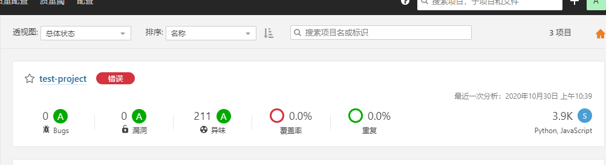

# 基于sonarqube的代码分析

目录

- [基于sonarqube的代码分析](#基于sonarqube的代码分析)    
  - [1. linux环境准备](#1-linux环境准备)
  - [2. 如何在windows本地进行sonarqube代码分析](#2-如何在windows本地进行sonarqube代码分析)   
  - [3. 如何在gitlab进行sonarqube代码分析](#3-如何在gitlab进行sonarqube代码分析)
  - [4. 3分钟学会使用sonarqube](#4-3分钟学会使用sonarqube)

## 1. linux环境准备
> 1).安装jdk11

> 2).安装postgresql-10

> 3).安装sonnarqube

> 4).安装sonnar-scanner

> 启动sonarqube,访问：192.168.102.27:9000

>账号及密码：admin/admin

> 


## 2. 如何在windows本地进行sonarqube代码分析

> 1).安装sonar-scanner-4.5.0.2216-windows

> 2).将bin目录配置到环境变量

> 输入sonar-scanner --version验证安装是否成功

> 3).到要检查的代码根目录下创建文件sonar-project.properties

> 文件内容如下:

``` 
sonar.projectKey=test-project						
sonar.projectName=V1
sonar.projectVersion=1.0							
sonar.sources=./
sonar.language=js
sonar.host.url=http://192.168.102.27:9000
sonar.sourceEncoding=UTF-8

```
> 4).命令行到要检查的代码目录下，输入命令：sonar-scanner

> 

> 检查的结果就可以在http://192.168.102.27:9000上查看

> 

## 3. 如何在gitlab进行sonarqube代码分析
> 1).到要检查的代码根目录下创建文件sonar-project.properties

> 文件内容如下:

``` 
sonar.projectKey=test-project						
sonar.projectName=V1
sonar.projectVersion=1.0							
sonar.sources=./
sonar.language=js
sonar.host.url=http://192.168.102.27:9000
sonar.sourceEncoding=UTF-8

```

> 2).yml脚本里添加以下代码

``` 
sonarqube:
  script:
    - cd /home/my_docker/demo
    - sonar-scanner
    - echo "done...."

```
> 3).每次有新的提交时就会触发脚本进行sonarqube代码分析

> 

> 检查的结果就可以在http://192.168.102.27:9000上查看

> 

## 4. 3分钟学会使用sonarqube

> sonarqube使用非常方便，前端界面新建一个项目，进行相应的配置后，sonarqube就会给出细致的流程以便用户快速的进行代码分析

> 