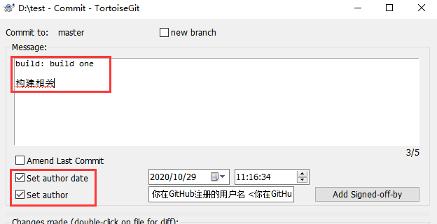
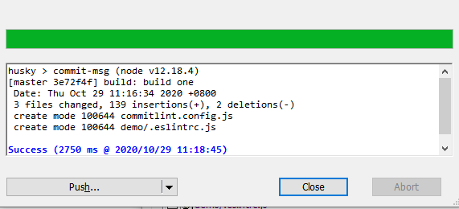
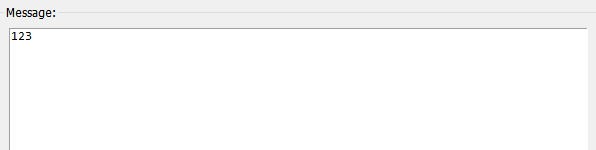
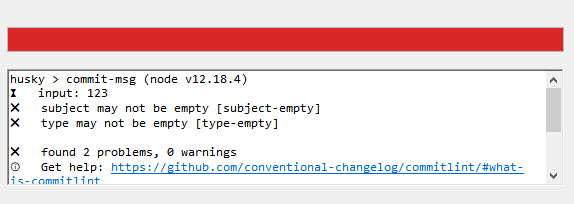
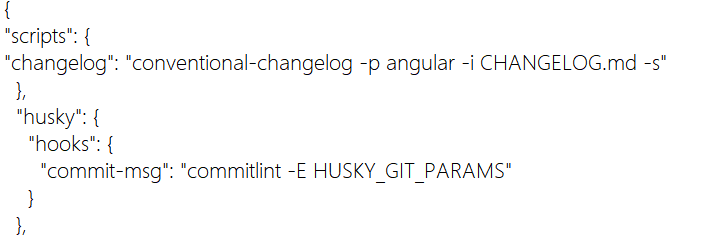

# 提交规范检查

目录

- [提交规范检查](#提交规范检查)    
  - [1. 安装commitlint](#1-安装commitlint)
  - [2. 安装与配置husky](#2-安装与配置husky)   
  - [3. 测试一下commitlint](#3-测试一下commitlint)  
  - [4. 引入conventional-changelog生成项目变更日志](#4-引入conventional-changelog生成项目变更日志)

## 1. 安装commitlint
> 1).项目根目录下安装commitlint

> npm i -D @commitlint/cli @commitlint/config-angular

> 2).项目根目录新建配置文件 commitlint.config.js

> 文件内容参考如下:

``` 
'use strict';
const message = process.env['HUSKY_GIT_PARAMS'];
const fs = require('fs');
 
const types = [
  'build', // 构建执行
  'chore', // 构建工具相关
  'ci', // CI 相关
  'docs', // 文档更新
  'feat', // 新功能
  'fix', // bug 修复
  'perf', // 性能优化
  'refactor', // 功能重构
  'release',
  'revert', // 回滚操作
  'style', // 样式变动
  'test', // 单元测试
];
 
const scopes = ['showcase', 'packaging', 'changelog', 'schematics', 'module:*'];
 
function parseMessage(message) {
  const PATTERN = /^(\w+)(?:\(([^)]+)\))?\: (.+)$/;
  const match = PATTERN.exec(message);
  if (!match) {
    return null;
  }
  return {
    type: match[1] || null,
    scope: match[2] || null,
  };
}
 
function getScopesRule() {
  const messages = fs.readFileSync(message, { encoding: 'utf-8' });
  const parsed = parseMessage(messages.split('\n')[0]);
  if (!parsed) {
    return [2, 'always', scopes];
  }
  const { scope, type } = parsed;
  if (scope && !scopes.includes(scope) && type !== 'release' && !/module:.+/.test(scope)) {
    return [2, 'always', scopes];
  } else {
    return [2, 'always', []];
  }
}
 
module.exports = {
  extends: ['@commitlint/config-angular'],
  rules: {
    'type-enum': [2, 'always', types],
    'scope-enum': getScopesRule,
  },
};

```
## 2. 安装与配置husky

> 1).安装husky

> npm i -D husky

> 2).在package.json中配置husky

> 文件内容如下:

``` 
"husky": {
  "hooks": {
    "commit-msg": "commitlint -E HUSKY_GIT_PARAMS"
  }
},

```
## 3. 测试一下commitlint

> 1).正确书写

> 书写格式：

``` 
type(scope): subject

body

footer

说明：
type：用于说明 commit 的类别，主要为以下内容，必选项
  'build', // 构建执行
  'chore', // 构建工具相关
  'ci', // CI 相关
  'docs', // 文档更新
  'feat', // 新功能
  'fix', // bug 修复
  'perf', // 性能优化
  'refactor', // 功能重构
  'release',
  'revert', // 回滚操作
  'style', // 样式变动
  'test', // 单元测试
scope：是指明此次提交的影响范围，可选项
subject：是对commit内容的的简短描述，必选项
body：对本次commit的详细描述，可以分成多行，可选项
footer：描述不兼容变动，关闭issue，可选项

```
> 注：冒号后有空格

> 

> 

> 2).错误书写

> 

> 

## 4. 引入conventional-changelog生成项目变更日志

> 1).安装conventional-changelog：

> npm i -D conventional-changelog-cli

> 2).在 package.json 的 scripts 下加个脚本：

> 文件内容如下:

``` 
"scripts": {
  "changelog": "conventional-changelog -p angular -i CHANGELOG.md -s"
}

```
> 

> 3).测试一下效果

> npm run changelog

> 4).生成完整的 CHANGELOG.md 文件：

> npm run changelog -- -s -r 0